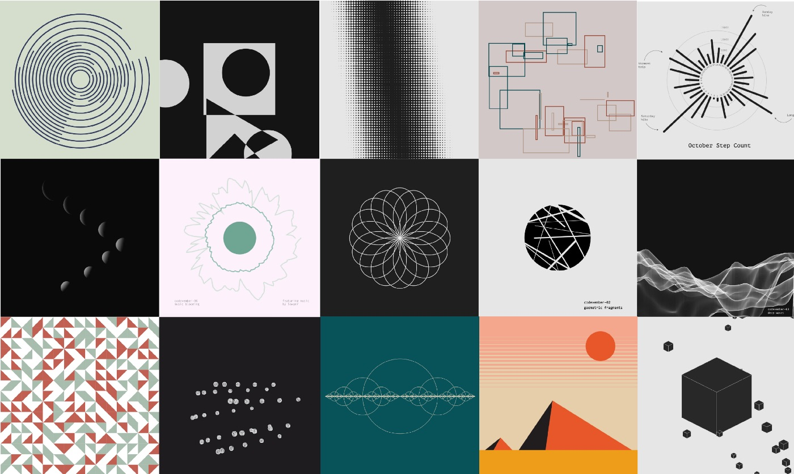
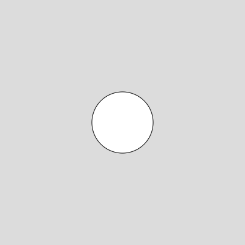
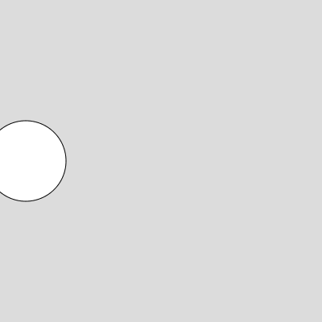

## What Is Creative Coding?

Creative coding is the practice of using **code as a tool for artistic expression**. Unlike traditional programming, which focuses on solving problems or building applications, creative coding is about **making visuals, animations, and interactive art**.



Some things you can create with creative coding:
- **Digital art and generative patterns**
- **Animations and interactive sketches**
- **Music visualizations**
- **Web-based games and interactive experiments**

## What Is p5.js?

[p5.js](https://p5js.org/) is a **JavaScript library** that makes it easy to create art and animations with code. It allows you to draw shapes, add colors, animate objects, and respond to user input—all **directly in a web browser**.

### Why p5.js?
- **Beginner-friendly**: No need to install anything—just start coding in the browser.
- **Interactive & real-time**: See your code change instantly.
- **Great for artists**: Designed for creative projects, not just technical programming.

## Getting Started: Your First p5.js Sketch

### Start Coding Now!

You don’t need to install anything to try p5.js—just visit the [**p5.js Web Editor**](https://editor.p5js.org/) and start writing code! 🚀

---

To begin, let's create a **simple drawing** using p5.js. Every p5.js project has two important functions:

1. **`setup()`** – Runs once at the start to set up the canvas.
2. **`draw()`** – Runs repeatedly to update the screen.

Here’s how to draw a **circle**:

```javascript title="sketch.js"
function setup() {
  createCanvas(400, 400); // Set up a 400x400 pixel canvas
}

function draw() {
  background(220); // Light gray background
  ellipse(200, 200, 100, 100); // Draw a circle at (200, 200) with a size of 100
}
```

### Breaking It Down:
- **`createCanvas(400, 400)`** – Makes a 400x400 pixel area to draw on.
- **`background(220)`** – Sets a light gray background.
- **`ellipse(200, 200, 100, 100)`** – Draws a circle at `(200, 200)` with a width and height of `100`.



:::tip
Try changing the numbers in `ellipse()`—what happens?
:::

## Understanding Variables: Storing Values

In coding, a **variable** is like a container that holds a value. Instead of writing numbers directly, we can store them in variables and use them later.

```javascript title="sketch.js"
let circleX = 200; // Store the x position of the circle
let circleY = 200; // Store the y position of the circle

function setup() {
  createCanvas(400, 400);
}

function draw() {
  background(220);
  ellipse(circleX, circleY, 100, 100); // Use variables to position the circle
}
```

Now, instead of `200`, we use `circleX` and `circleY`. This makes our code **easier to modify**.

## Making Things Move: Updating Variables

To make something move, we **change a variable** over time. Let’s make the circle move across the screen.

```javascript title="sketch.js"
let circleX = 0; // Start at the left side

function setup() {
  createCanvas(400, 400);
}

function draw() {
  background(220);
  ellipse(circleX, 200, 100, 100); // Use circleX for position

  circleX = circleX + 2; // Increase x position every frame
}
```

### How It Works:
- The variable `circleX` starts at `0` (left side of the screen).
- Each frame, we **add 2** to `circleX`, moving the circle **to the right**.
- The `draw()` function runs **60 times per second**, making the motion smooth.



:::caution
What happens when `circleX` gets too big? Try printing `circleX` in the console!
:::

You can print values to the console using **`console.log()`**.
For example, in sketch.js, you can log the circleX variable inside the draw() function like this:

```javascript title="sketch.js"

function draw() {  
  console.log(circleX)
}

## Making Interactive Art: Using the Mouse

p5.js has built-in variables like `mouseX` and `mouseY` that track the mouse position. Let’s use them to make our circle **follow the mouse**:

```javascript title="sketch.js"
function setup() {
  createCanvas(400, 400);
}

function draw() {
  background(220);
  ellipse(mouseX, mouseY, 100, 100); // The circle follows the mouse
}
```

Now, the circle will always be **where your mouse is**!

## Colors and Customization

You can customize colors using `fill()` (for shape color) and `stroke()` (for outlines):

```javascript title="sketch.js"
function setup() {
  createCanvas(400, 400);
}

function draw() {
  background(0); // Black background
  fill(255, 0, 0); // Red color
  stroke(255); // White outline
  ellipse(200, 200, 100, 100);
}
```

- **`fill(r, g, b)`** – Sets the color of shapes (red, green, blue).
- **`stroke(r, g, b)`** – Sets the outline color.

## What’s Next?

You’ve just scratched the surface of **creative coding with p5.js**! Here’s what you can explore next:

👉 [**Understanding Shapes and Colors in p5.js**](https://www.artecs.org/posts/p5js-shapes-and-colors/)

:::important
Experiment, play, and have fun! 🎨✨
:::

Post by: Gabriel Alonso


