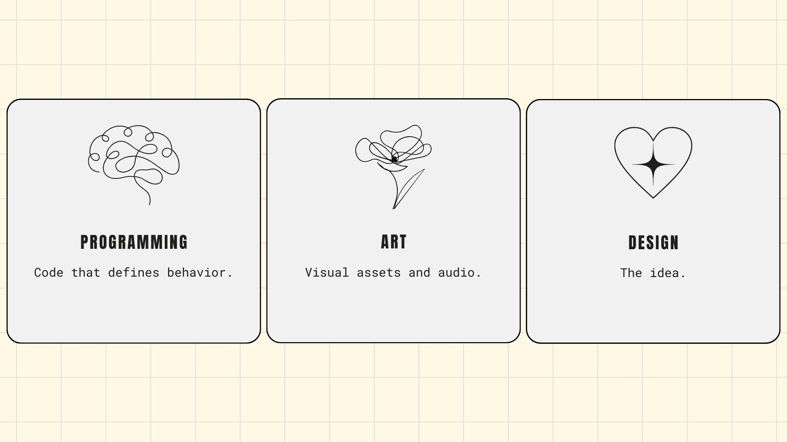
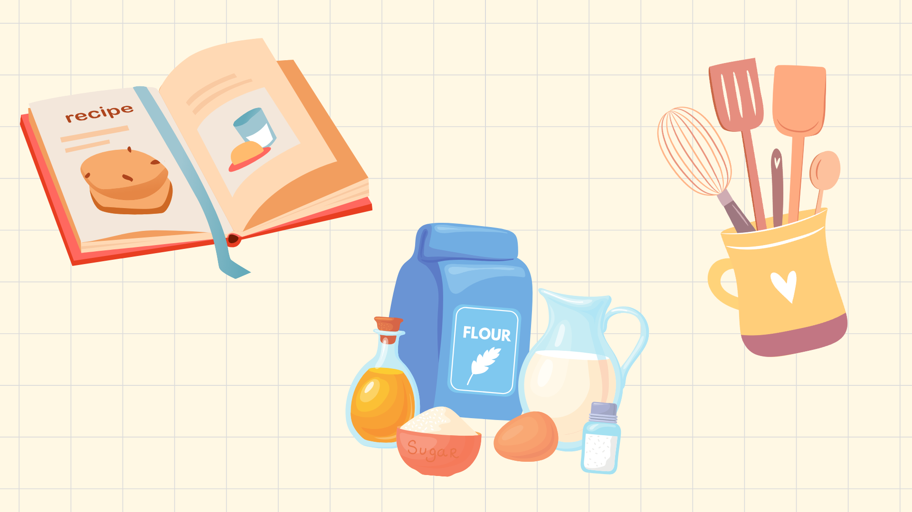

## What Is Game Development?

Game development is the process of **designing, creating, and programming** interactive digital experiences, commonly known as *video games*. It involves multiple disciplines, including **game design, programming, art, sound design, and storytelling**, to bring immersive and engaging worlds to life.



## Computers Are Powerful but Need Precise Instructions

Game development is all about turning **creative ideas** into **interactive experiences**. But to make a game, we need a way to **communicate our vision** to the computer. 

:::tip
Computers follow instructions exactly as given, so precision in programming is essential.
:::

Computers don’t think on their own. They’re essentially **lifeless machines** that process instructions **exactly** as given. 

If you tell a computer to **“make a character jump,”** it won’t understand unless you provide **precise details**:

- **How high** should the jump be?  
- **How fast** should the character move?  
- **Should gravity** pull them back down?  

For example, in the [**Godot engine**](https://godotengine.org/) (a software framework used to build games), if you want to move a character, you might write something like this:

```python title="file.gd"
velocity.y -= 300 # Moves the character up
```

This line tells the computer to **decrease the character’s vertical position**, simulating an **upward motion**. The number **300** represents how much force is applied. Understanding how **numbers** and **functions** interact in code is essential for game development.

:::important
After reading, check out [this post](https://artecs.org/) to learn more about what game engines are and why they’re important!
:::

## The Structure of Code in Game Development

Writing code isn’t the same as writing a sentence in **English**. **Programming languages** have strict **syntax** and **structure**, defined by the tools and engines developers use.  

For instance, in **Godot**, functions follow a specific format:

```python title="file.gd"
definition_name(parameters):
    # Instructions go here
```

If you wanted to create a **function** to make a character **jump** when a player presses a key, it might look something like this:

```python title="file.gd"
func jump():
    velocity.y = -400
```

Every **function** follows a **predefined pattern**, and learning how to read **technical documentation** will help you understand and use new functions effectively. The [**Godot documentation**](https://docs.godotengine.org/en/stable/about/introduction.html) acts as a reference, much like a **dictionary**, allowing developers to look up specific **code expressions** and understand how they work.


## How to Make a Game: A Simple Analogy

Making a game is a lot like cooking:

- **Code = The recipe** (instructions on how the game behaves).
- **Assets = The ingredients** (visuals, sounds, and other media used in the game).
- **Game engine = Kitchen tools** (the software that helps combine everything into a playable game).



Without **code**, the game has no **structure**.  
Without **assets**, it lacks **visuals** and **sounds**.  
And without a **game engine**, there’s no way to put everything together efficiently.  

Learning how to use these elements effectively is **key to becoming a game developer**.

:::caution
A game without proper structure can be messy and inefficient, leading to performance issues and bugs.
:::

## Learning to Code for Game Development

Game development isn’t just about learning a **programming language**—it’s about developing a **problem-solving mindset**.  

Throughout the learning process, you’ll encounter **challenges** that require **creative solutions**, like making an enemy **chase the player** or ensuring **smooth movement physics**.  

By practicing game development, you’ll learn:  

- **Fundamental programming concepts** such as **variables, loops, and functions**.  
- How to **structure your game’s logic efficiently**.  
- The ability to **read and understand code** from references and examples.  
- How to **think like a game developer** and break **complex problems** into **manageable pieces**.  

## Your Journey to Becoming a Game Developer

No single **course** or **tutorial** will make you a professional overnight. Like any **skill**, mastering **game development** takes **time** and **practice**. The key is to **start small**—create **simple games**, experiment with **mechanics**, and gradually take on **more complex projects**.  

With each project, your **understanding** will grow, and so will your ability to **solve problems independently**. The goal is not just to **follow step-by-step tutorials**, but to reach a point where you can **build your own games from scratch**.

## What’s Next?

In the next sections, we’ll discuss:

👉 [**What Are Game Engines?**](https://artecs.org/)

:::important
Stay motivated, experiment often, and enjoy the process of bringing your game ideas to life!
:::
