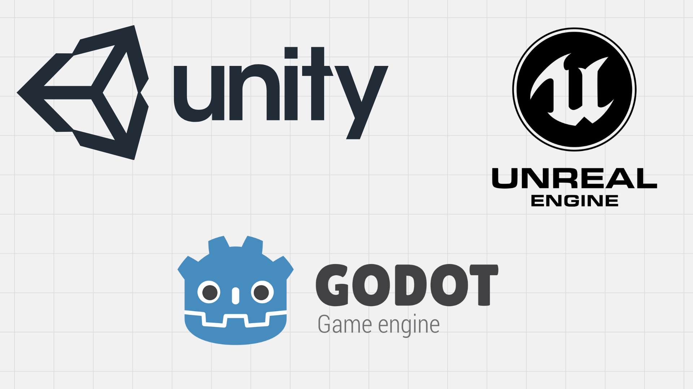
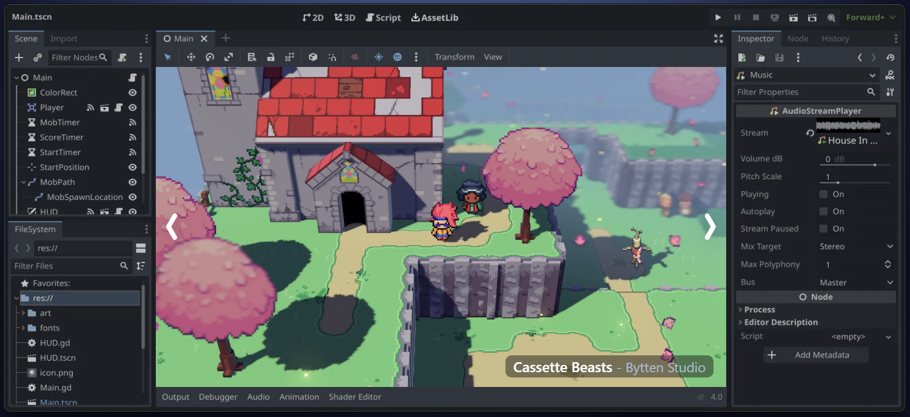

## What Is a Game Engine?

A **game engine** is a software framework that provides essential tools to create video games. Instead of programming everything from scratch, developers use a game engine to handle key aspects of a game, such as:

- **Rendering** – Drawing graphics on the screen.
- **Physics** – Simulating motion and collisions.
- **Input Handling** – Processing keyboard, mouse, or controller inputs.
- **Audio** – Managing sounds and music.
- **Scripting** – Defining game logic using code.

Using a game engine allows developers to focus on designing gameplay rather than reinventing the wheel for every new project.

:::tip Why Use a Game Engine?
Game engines streamline the development process by providing a structured environment. Without one, developers would have to manually code every aspect of a game, from physics to rendering—a time-consuming task. Instead, engines like **Godot, Unity, and Unreal Engine** offer built-in tools to speed up development.
:::

### Benefits of Using a Game Engine

✅ **Cross-platform support** –> Build games for PC, consoles, and mobile devices.
✅ **Optimized performance** –> Engines handle rendering and physics efficiently.
✅ **User-friendly editors** –> Visual tools help with game design.
✅ **Active communities** –> Access documentation, tutorials, and forums for help.

## What Is Godot?

[**Godot**](https://godotengine.org/) is an **open-source** game engine known for its flexibility and ease of use. Unlike proprietary engines, Godot is completely free with no licensing fees, making it an excellent choice for indie developers and hobbyists.

### 🏆 Key Features of Godot

- **Node-based architecture** –> Organize game elements intuitively.
- **GDScript** –> A simple yet powerful scripting language inspired by Python.
- **2D & 3D support** –> Develop both 2D and 3D games efficiently.
- **Lightweight & Fast** – Minimal system requirements with a small installation size.
- **Active Development** –> Constant updates and community-driven improvements.

:::caution Why Choose Godot?
Unlike other engines, Godot does not charge royalties or require subscriptions. You own everything you create without hidden costs.
:::

## Godot in Action 🎥

To see what’s possible with Godot, check out the **Godot 2024 Showreel**, showcasing some of the best games made with this engine:

<iframe width="560" height="315" 
    src="https://www.youtube.com/embed/n1Lon_Q2T18?start=59" 
    title="Godot 2024 Showreel" 
    frameborder="0" 
    allow="accelerometer; autoplay; clipboard-write; encrypted-media; gyroscope; picture-in-picture" 
    allowfullscreen>
</iframe>

## Final Thoughts

Game engines empower developers to bring their ideas to life without reinventing core technologies. **Godot**, with its open-source nature and beginner-friendly design, is an excellent starting point for new game developers while still being powerful enough for complex projects.

## What’s Next?

In the next sections, we’ll discuss:

👉 [**Godot Beginner Tutorial**](https://artecs.org/)

Read the previous section:

[**Introduction to Game Development**](https://artecs.org/)

:::important
Stay tuned and keep experimenting!
:::
