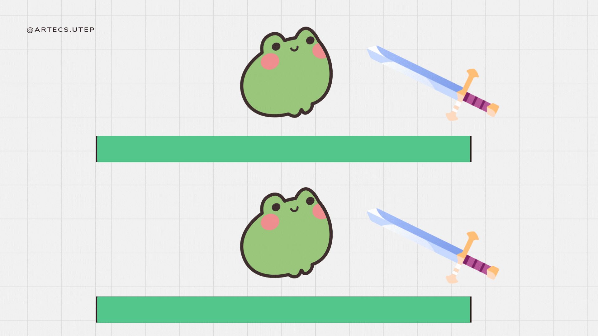
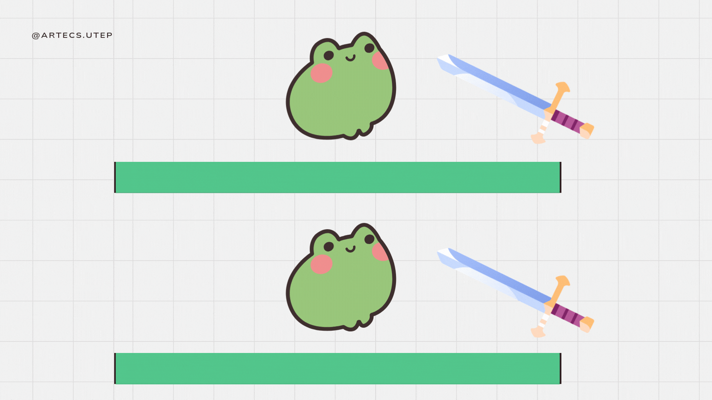

## Learning Godot: Why This Video?

Starting game development can be overwhelming, but thanks to great resources like **Brackeys' "How to Make a Video Game - Godot Beginner Tutorial"**, you don’t have to start from scratch. Instead of creating our own tutorial, we believe this video is an **excellent introduction** to Godot. It covers the **fundamentals of game creation**, and it’s the perfect **first step** before diving into more complex topics.

:::note
While we’ll be expanding with **our own guides** (which we’ll call **"Recipes"**), for now, this video provides **everything you need** to get started. Below the video, you’ll find a **glossary of key concepts**, so you can easily reference what you learn.
:::

---

## 🎥 Video Tutorial: _How to make a Video Game - Godot Beginner Tutorial_ by _Brackeys_

<iframe 
    src="https://www.youtube.com/embed/LOhfqjmasi0" 
    title="How to make a Video Game - Godot Beginner Tutorial" 
    frameborder="0" 
    allow="accelerometer; autoplay; clipboard-write; encrypted-media; gyroscope; picture-in-picture" 
    allowfullscreen 
    width="100%" 
    height="315">
</iframe>

---

## 📚 Godot Beginner Cheatsheet

### 🚀 Core Concepts
- **Node** –> Basic building blocks of games (e.g., player, enemy, platforms).
- **Scene** –> Reusable template composed of nodes.
- **Scene Tree** –> Hierarchical structure of nodes (parent-child relationships).

### ⏳ Delta Time
- **`delta`** –> Ensures consistent game speed regardless of frame rate:
 ```python title="file.gd"
  position += speed * delta
  ```

✅ **With** Delta Time: 

❌ **Without** Delta Time: 

### 🧩 Essential Nodes
- **CharacterBody2D** –> Player or NPC with physics-based movement.
- **StaticBody2D** –> Non-moving environment objects (ground, walls).
- **Area2D** –> Detects overlapping objects, useful for pickups or kill zones.
- **CollisionShape2D** –> Defines physical collision boundaries.
- **RayCast2D** –> Detects collisions in a specific direction.

### 🎨 Graphics & Animation
- **Sprite2D** –> Displays static images.
- **AnimatedSprite2D** –> Handles frame-based animations.
- **AnimationPlayer** –> Animates any property over time (position, visibility, audio).

### 🎯 Scripting (GDScript)
- **Built-in Functions:**
  - `_ready()` –> Runs once upon entering the scene.
  - `_process(delta)` –> Runs every frame for general logic.
  - `_physics_process(delta)` –> Fixed updates for reliable physics.
- **Signals** –> Execute code in response to events:
 ```python title="file.gd"
  func _on_body_entered(body):
      queue_free()  # Removes node from scene
  ```

### 📍 Node Referencing
- **Direct Reference (shortcut):**
 ```python title="file.gd"
  var player = $Player
  ```
- **Unique Nodes (using `%`):** Reference easily regardless of position:
 ```python title="file.gd"
  var manager = %GameManager
  ```
- **Autoload (Singleton):** Global scripts accessible everywhere:
 ```python title="file.gd"
  GameManager.score += 1
  ```

### 🔊 Audio
- **AudioStreamPlayer2D** –> Plays audio in 2D space.
- **Audio Bus** –> Manages grouped audio (music, effects).

### 📦 Exporting Your Game
- **Export Templates** –> Required to export for different platforms.
- **Embed PCK** –> Bundles assets into executable for easy sharing.

---

## What’s Next?

In the next sections, we’ll discuss:

👉 **[How to Program in Godot - GDScript Tutorial](#)**

Read the previous section:

[**What Are Game Engines?**](https://www.artecs.org/posts/game-engines-intro/)

:::important
Keep exploring, learning, and creating amazing games with Godot! 🚀
:::
