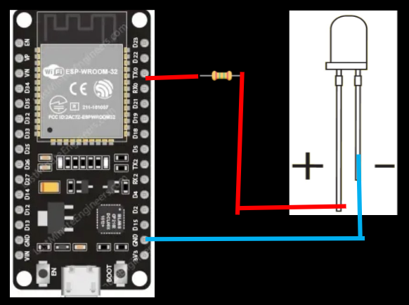

## **Mircrocontroller Workshop for Beginners**

A microcontroller is a programmable Circuit Board comprised of the necessary components to perform basic I/O operations.​ It's primarilly used for:

- Sensor data gathering​
- Simple information processing​
- Control external Devices (Servos, Leds, Buzzers, etc.)

It is designed for low power and simple operations.

### SBC vs MCU

Micro Controller Units (MCU's) are often confused with Single Board Computers (SBC's). Even though they perform similar functions, they have some differences that are highlighted here:

- **SBC: Single Board Computer ​**
  - Higher Power​
  - Can Run an OS​
  - All soldered into a single board​
- **MCU: Micro Controller Unit​**
  - Simple I/O Operations​
  - IOT devices​
  - Low power automation

### Examples

For Microcontrollers, some of the most well known are Arduino, ESP32, and ATmega. For SBC's we have the famous Raspberry Pi.

### Spec Sheets

When using a Micro Controller, it's very important that you know the specs of it (e.g. voltages, power supply, I/O pinout, architecture) in order to build your devices or work with your software.
[HERE](https://www.espressif.com/sites/default/files/documentation/esp32_datasheet_en.pdf) is an ecample of the one for the ESP32.
These are useful, but they may be a bit to much for our purpose. For that, we use this.

This pinout diagram tells us how we can connect our devices into the board to start controlling them. Here's an easy guide for you:

- The **black** pins marked with **GND** are for **Ground**.
- The **red** pins marked with **VIN, 3.3V**, or in some boards with **5V** (not available for ESP32) are the power supply.
- The **Purple ones** that say **GPIO#** are the pins where you can receive and send signals with the Micro controller from external devices.

### Hardware components

Now, we'll go over some hardware components useful for creating your projects. It's nothing very advances, but they're the building blocks of electronics.

#### LEDS

LEDs are simple electricity to light converters. They're usually great for your project to see if something is on, of or in a specific status. Be careful, cause their current is unidirectional, meaning that you wire them the wrong way and you can fry them, the image above displays how it works, but we'll do an exercise with one later. Also, you'll need a 330 Ohms resistor to avoid burning the LED out.

#### Resistors

These components limit the flow of current in a circuit. The resistance is measured in Ohms, and to determine how much resistance does a resistor provide, you can base it on the image above. It's commonly used in circuits to protect circuits from too much current, but because of it's properties, it has been found that it can be also used as a heat source.

##### Capacitors

This is a brief storage unit which allows to provide energy to sections where the initial source may be limited to providing because of design constraints. As you may see in the image, there are several types, but we won't go into detail of which one does what (those are plans for next semester). You can measure a capacitors capacity in Farads (F), but it's usually measured in microfarads.

#### Diodes

The diodes are current rectifiers. In other words, it allows current to flow in a single direction. These are designed to not fail if you reverse the voltage.

#### Inductors

They're similar to capacitors, but the difference is that they store their energy in the form of magnetic current, which is measured in Henries (H).

#### Transistors

The building blocks of computers. These are switches that turn on/off with the use of voltage or current. There are 2 types:

##### Mosfets

These switches are controlled by voltage and generally faster. These are usually for power electronics and digital logic.

##### BJT's

These switches are controlled by curren, and they're slower than mosfets. These are more for analog cicuits.

#### Sensors

These devices come in multiple flavors, sounds, colors, etc. Or well, at least they can detect them and translate them into something an electronic device can understand (usually a computer). These, once processed by the computer, can be used to produce output. We will be using a simple sensor for this workshop.

#### Shields

Don't build from scratch, use a shield​! Shields are a set of components easily connectable to a micro controller board​. These include screens, other controllers, buttons, etc.

### Breadboards

Breadboards are useful tools when developing electronics. INstead of having to solder and desolder, you can simply prototype with this great tool and some jumper wires.

As you may see in the folloowing image, breadboards have 6 columns:

- 2 **positives** on the very outside (red)
- 2 **negatives** next to the positives (blue)
- 2 for **device connections** (wide columns in the middle)

You can just simply connect your negative and your positive source into the side columns, and wire from there to the rest of the positives and negatives in the circuit so you don't have many connections to the source.
For the remaining connections between devices and to the outer columns, they can be done in the middle columns. If you want a better understanding on how this diagram works, you can refer to the following image, where you can see an open breadboard.

### First Exersice

Here, we will teach you the most basic example for how to use a Micro Controller with an ESP32 and a LED.

#### Connections

1. We'll connect the shorter leg of an ESP to a GND PIN (-).
2. Then we'll connect a 330 Ohm resistor to pin 3 (TX0) on the board.
3. Finally, we'll connect the positive (+) leg,or long leg, of the leg to the other side of the resistor.

#### Setting up your development environment

:::note
For the following part, you'll need a USB cable to connect the ESP32 to your PC (Check the connection of your ESP32 if it needs micro USB, USB-B or USB-C).
:::

You must go to [this website](https://www.arduino.cc/en/software/) and install it for your OS.

Once installed, you should see a screen like this

Here you see a few key components that'll help you start developing.

1. Your code editor to develop your code

2. The output window, where any output related to program compilation is displayed (ie. error and success messages).

3. The serial console, where all data received from the microcontroller shall be displayed.

4. The compile (checkmark) to compile your code (translate it into machine-readable code) and the upload button (To upload your code to the board)

5. The library manager, to install and uninstall libraries.

6. The boards manager to select your board and download its respective libraries to work with the code.

7. And the board selection dropdown.

##### Connecting the board

To start, just connect your board via USB or USB-C to your computer.

Once connected, the board shall be recognized by the Arduino IDE, if not, go through the next steps.

Post by: **Rafael Garcia**
