## **Introduction to Pixel Art**

Pixel art is a **form of digital art** created by placing individual pixels in a way that resembles the aesthetics of **8-bit or 16-bit games**. Even with modern technology, pixel art remains popular for its **retro charm** and for the unique **restrictions** it places on size and color palettes.

:::note
Despite its name, “pixel art” doesn’t always strictly use **literal pixels**—the style and techniques can be applied at any resolution.  
:::

## **Getting Started with Piskel**

[Piskel](https://www.piskelapp.com/) is an **online application** designed for creating pixel art and sprites. Its intuitive interface and straightforward tools make it an excellent place to begin exploring pixel art.  

If you’re looking for an alternative, [Pixelorama](https://orama-interactive.itch.io/pixelorama) is another great option.

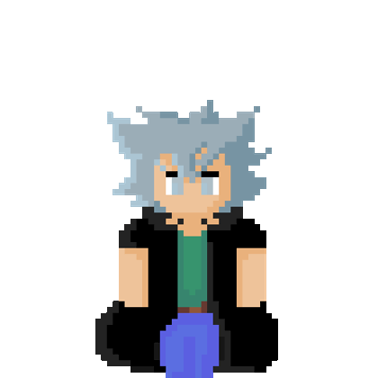

### **Piskel Tools Overview**

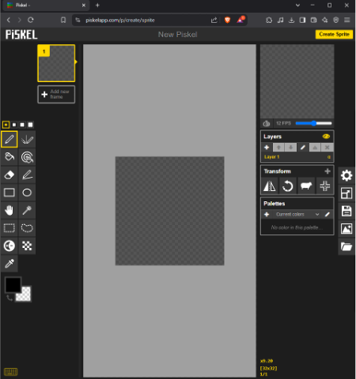

Below are some essential tools you’ll find in Piskel:

- **Pen Tool** – Basic brush for freehand pixel drawing.  
- **Paint Bucket** – Fills a continuous area with the selected color.  
- **Eraser** – Removes pixels, acting as a basic erasing tool.  
- **Rectangle Tool** – Draws rectangles of any size.  
- **Move Tool** – Moves selected parts of the drawing around the canvas.  
- **Rectangle Selection** – Selects a rectangular area for editing or moving.  
- **Lighten Tool** – Lightens or darkens an area with brush strokes.  
- **Color Picker** – Selects a color from the canvas to add to your palette.  
- **Vertical Mirror Pen** – Mirrors brush strokes across the y-axis for symmetrical designs.  
- **Paint Bucket (Fill Similar Colors)** – Fills all pixels of the same color in the canvas with a new color.  
- **Stroke Tool** – Draws straight lines between two points.  
- **Circle Tool** – Creates perfect or elliptical circle shapes.  
- **Shape Selection** – Selects a continuous colored area for editing or moving.  
- **Lasso Selection** – Allows freeform selection of any area, regardless of shape. 
- **Dithering Tool** – Applies a pixelated shading effect for smoother gradients and textures.

## **Color in Pixel Art**

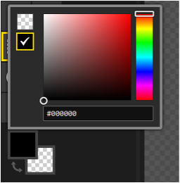

Color choices in pixel art can drastically affect your final design.  

:::important
1. **Color Square**: Familiarize yourself with it—this is where you’ll pick and tweak your colors.  
2. **Color Palette**: A curated palette keeps your work consistent. You can use Piskel’s default palette or import your own.  
3. **Shading**: For each color, use at least **three shades**—base color, darker shade (shadow), and lighter shade (highlight).  
4. **Fewer Colors**: Smaller pixel art typically looks cleaner with fewer colors.
:::

### **Shifting Tones**
- **Darker colors** tend to shift toward the **blue** spectrum.  
- **Lighter colors** lean closer to the **yellow** spectrum.  

This subtle shift can add more depth to your shading and make your sprite more visually interesting.

## **Line Style**

When drawing lines in pixel art, you’ll notice they can appear thicker than usual. Here are some pointers:

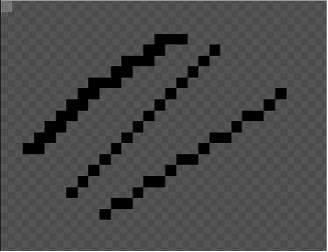

1. **Avoid sharp corners**: Single-pixel corners can make lines look bulky.  
2. **Experiment with styles**: Some art styles use these “bulky” corners intentionally for a bold look.  
3. **Stay consistent**: If you choose a particular line style, apply it throughout your artwork.

## **Activity: Creating Your First Sprite**

Let’s make a simple **slime** sprite to get you started!

1. **Choose a base color**: Select a bright color for your slime.  
2. **Draw a circle**: Use the **Pen** or **Circle Tool** to create a rough circular shape.  
3. **Fill the circle**: Use the **Paint Bucket** to fill it with your chosen color.

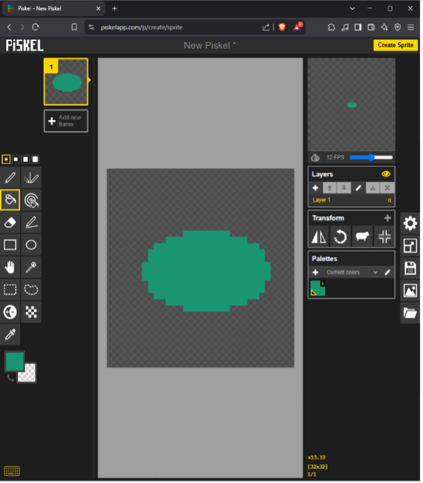

4. **Add an outline**: Pick a darker shade (or black) and outline the slime to give it definition.  
5. **Draw eyes**: Switch to black or another dark color to create two simple eyes.

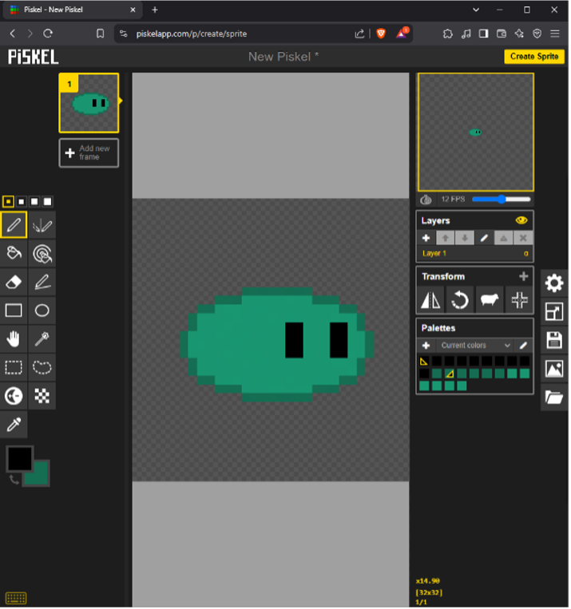

6. **Highlight & shade**: Use slightly lighter and darker tones of your base color to give the slime a 3D look.

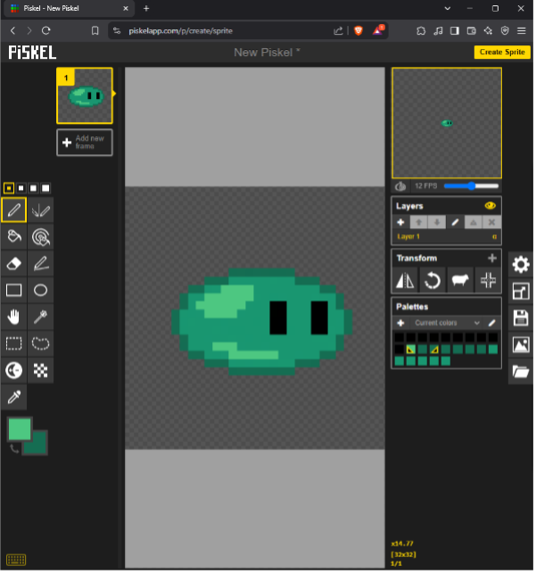

:::note
Remember: If you want a **darker** color, shift closer to **blue**. For a **lighter** color, shift closer to **yellow**.
:::

## **Animating Your Pixel Art**

Pixel art animation involves drawing each **frame** to simulate movement. Each new frame is a small change from the previous one, creating the **illusion of motion** when played in sequence.

### **Key Aspects of Pixel Art Animation**

- **Frame-by-Frame Movement**: Manually drawn frames ensure control over every detail.  
- **Keyframes & In-Between Frames**: Major poses vs. minor transitions.  
- **Limited Frames**: Embrace a retro aesthetic or keep animations simple.  
- **Subtle Changes**: Even tiny pixel shifts can create expressive, fluid animations.  
- **Consistent Color & Shading**: Keep your palette and shading style consistent across frames.

### **Activity: Simple Slime Animation**

Let’s animate our slime with a **simple “bounce”** effect:

1. **Duplicate the frame**: In Piskel, hover over your frame and select “Duplicate.”  
2. **Select & move**: Use the **Rectangle Selection** tool to select the top half of the slime. Press **Shift** as you drag it up or down.

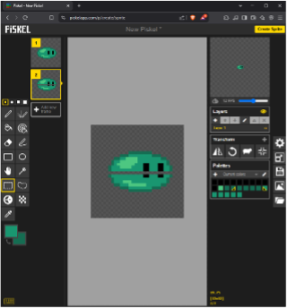

3. **Fill gaps**: Fill any missing areas with the appropriate colors.

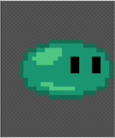

4. **Preview**: Check the animation on the **top-right preview panel**. Adjust the **FPS** (frames per second) to control speed.  

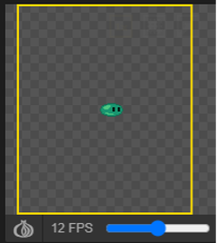

:::important
If the animation is too fast or too slow, adjust the **FPS** slider. Experiment until you find a speed that looks just right.
:::

### **Exporting Your Animation**

In Piskel, you can export your animation as a **GIF** or **PNG** sequence:

1. Click the **export icon** on the right edge of the screen.  
2. **Download the GIF** or generate a **URL** to share it online.

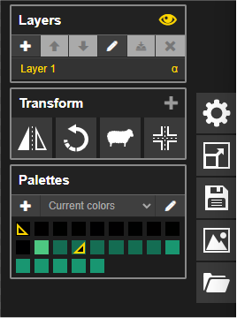

3. Use the **scale slider** if you want a larger or smaller final image.

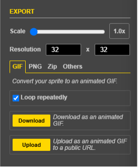

---

## **Final Thoughts**

Pixel art offers a **fun, approachable** way to learn about color, shading, and animation—without the complexity of larger-scale digital illustrations. By **practicing** simple shapes, **experimenting** with color shifts, and **creating basic animations**, you’ll gain a strong foundation in this retro-inspired art form.

🎨 **Next Steps?**  
- **Experiment** with different sprites: characters, objects, or environment tiles.  
- **Add more frames** to your animation for smoother motion.  
- **Try out dithering** for shading and texture variations.

:::important
Keep practicing! Pixel art is all about **patience** and **iteration**. The more you experiment, the more you’ll develop your own style.
:::

Post by: **Mauricio Rojo**
