## **UI/UX Design: Where to Start?**  

How do you go from tools to **designing real products**? UI design tools are easy to learn but hard to master. The key is **knowing what you need to do** to make user-friendly and visually appealing designs.  

:::note
This post breaks down the **fundamentals** of UI/UX design: **user flow**, **wireframing**, **design systems**, and **actual UI design**.  
:::

## **Step 1: Understanding User Flow 📍**  

Before designing, you need to map out **how users will navigate** your product. Users visit your website, app, or game with a goal—whether it's **finding information, purchasing something, or interacting with a service**.  

A **user flow diagram** helps visualize their journey. For example, in a website design project, if users are meant to find design inspirations, the **user flow** ensures they quickly locate categories and content.  

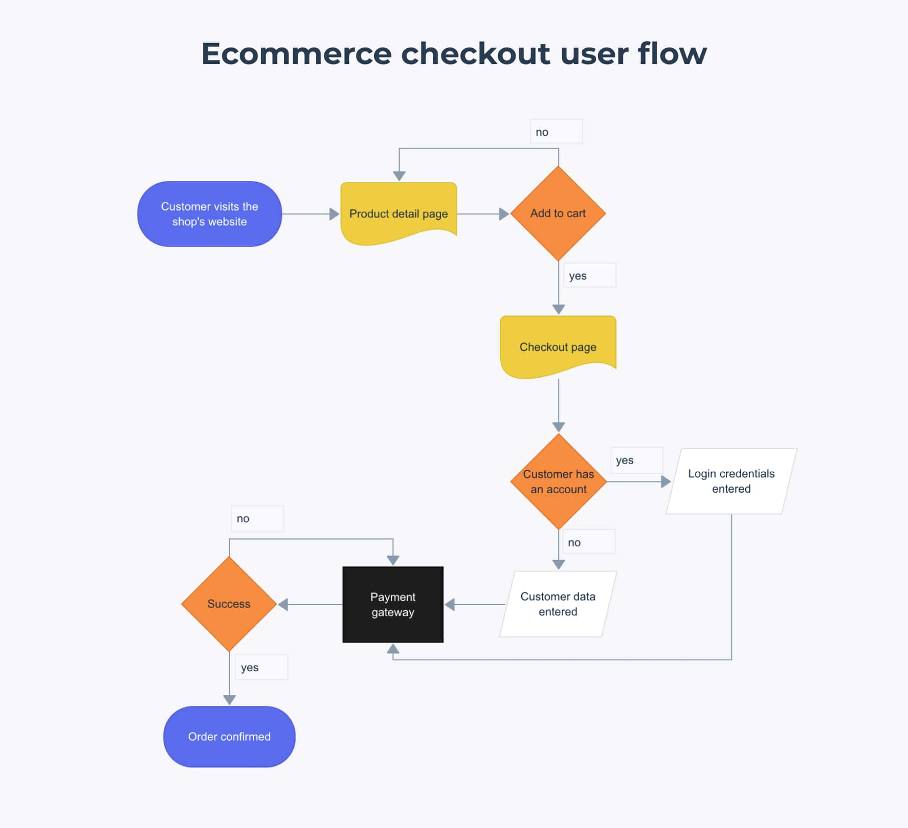

This **Ecommerce Checkout User Flow** visually represents the steps a user takes when purchasing a product online. The flow starts when a **customer visits the shop’s website** and navigates to a **product detail page**. If they decide to **add the item to the cart**, they proceed to the **checkout page**.

At checkout, the user is asked whether they have an account:
- **If they do**, they log in.
- **If they don’t**, they enter their details manually.

Once customer details are verified, they proceed to the **payment gateway**. If the payment is successful, the order is confirmed. If unsuccessful, the process may need to be retried.

### **User Flow in Game Design 🎮**  

Let’s see how user flow applies to **game design** by looking at a typical **level progression system** in a game:  

1️⃣ **Menu Screen** –> The player starts at the main menu, where they can navigate options like “Start Game,” “Settings,” or “Load Game.”

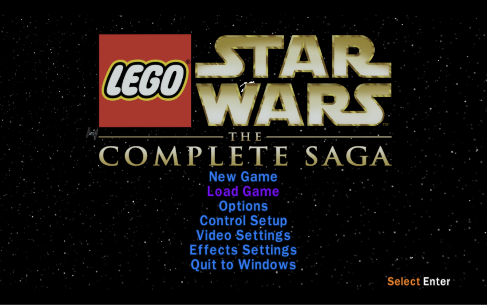

2️⃣ **Hub Area** –> Many games feature a hub world where players can explore, manage inventory, or select missions.

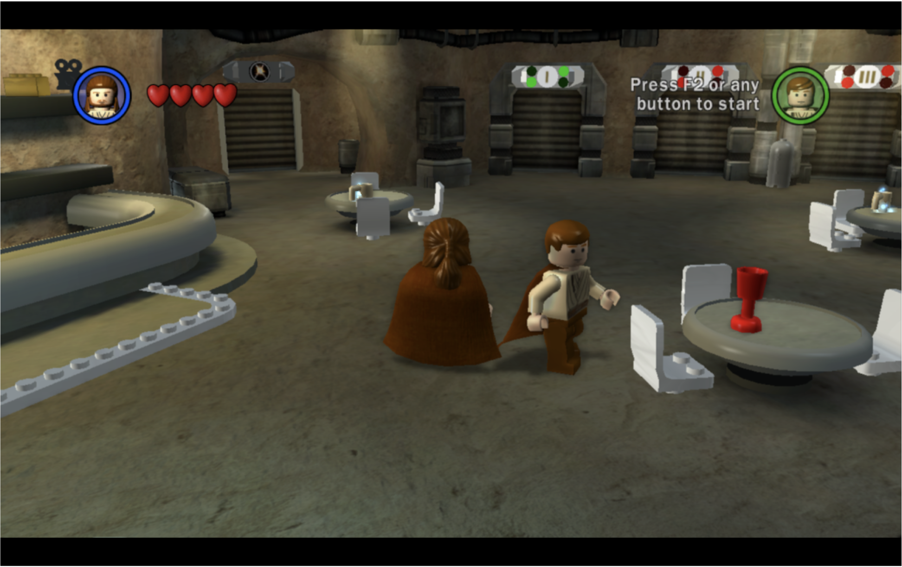

3️⃣ **Select Level** –> Players choose a level from a list, a map, or an interactive world.

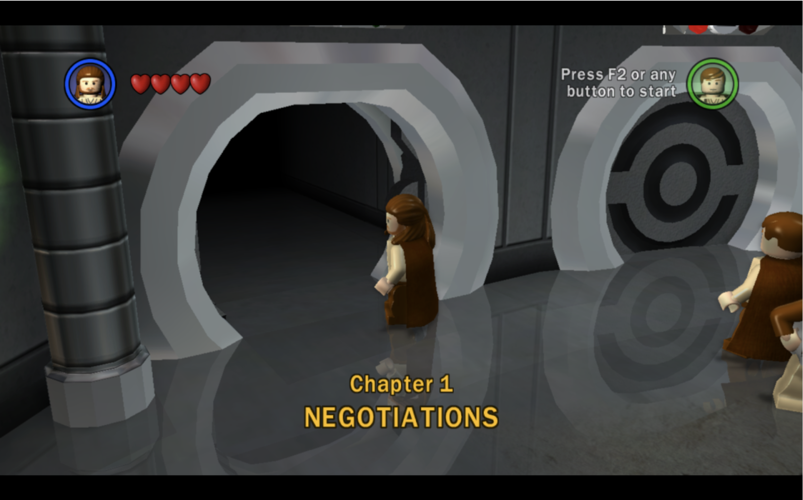

4️⃣ **Watch Cutscene** –> If the game has a story-driven experience, players might watch a cutscene before gameplay begins.  

5️⃣ **Play Level** –> The player engages in the core gameplay, completing objectives or challenges.  

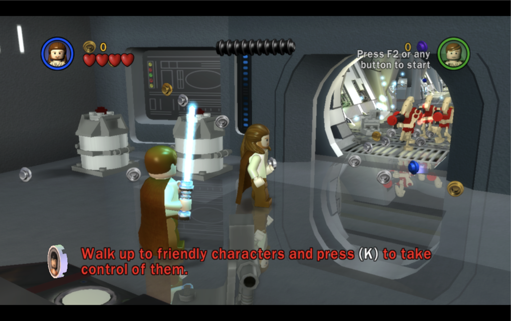

This structured approach ensures players **intuitively progress** through the game without confusion.  

:::important
User flow in games helps designers plan **smooth and engaging player experiences**, making sure transitions between **menus, levels, and gameplay** feel **natural and seamless**.
:::

## **Step 2: Wireframing 📝**  

Once the user flow is clear, the next step is **wireframing** (a blueprint of your design). Each screen or page should contribute to **achieving the user’s goal**.  

Back in the **1600s** (okay, not really), wireframing was done with pen and paper. Today, tools like [**Balsamiq**](https://balsamiq.com/) or [**Figma**](https://www.figma.com/) make the process digital.

:::important
For a simple, intuitive UI, wireframes should focus on **structure, navigation, and key interactions**
:::

### **Types of Wireframing**  
Wireframing is divided into three levels based on detail and complexity:  

🔹 **Low-Fidelity Wireframes:** Simple sketches or digital outlines. You can even use **pen and paper** to start visualizing your layout. These focus on structure without detailing visuals.  
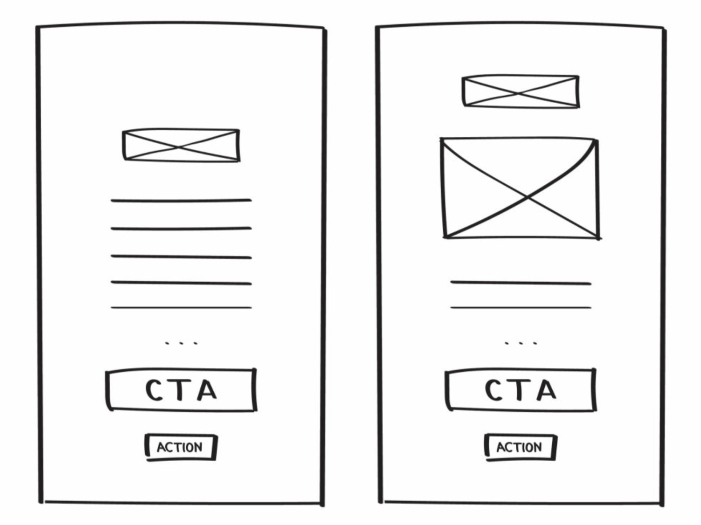

🔹 **Medium-Fidelity Wireframes:** More refined than low-fidelity, incorporating **clearer layouts and basic UI elements**. These are often done digitally but lack final design details.  
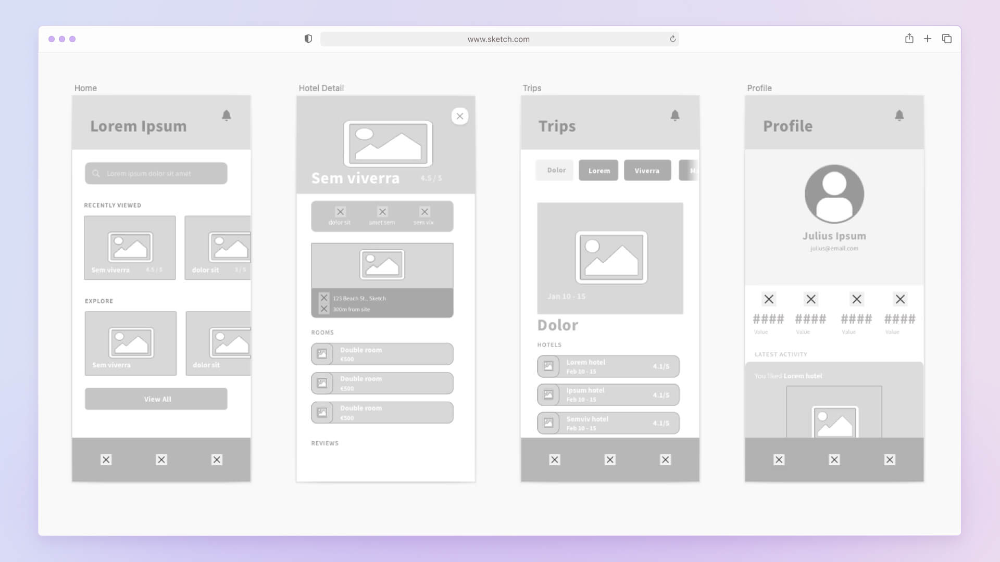

🔹 **High-Fidelity Wireframes:** **Closer to the final design**, including **refined UI elements, typography, and accurate spacing**. These wireframes resemble the finished product but lack full interactivity.
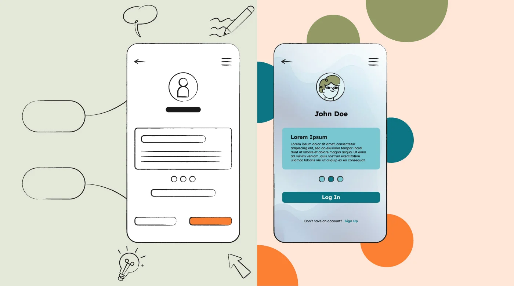

## **Step 3: Creating a Design System 🎨**  

This marks the beginning of **UI (User Interface) design**, where we bring **visual consistency** to the project. A **design system** ensures that colors, fonts, buttons, and icons are **uniform** across the product.  

### **Color & Typography**  
**Fonts** define the **tone** of your design. Want something formal? Elegant? Playful? Try out fonts from [**Google Fonts**](https://fonts.google.com/) and use tools like [**Type Scale**](https://typescale.com/) to set readable text sizes.

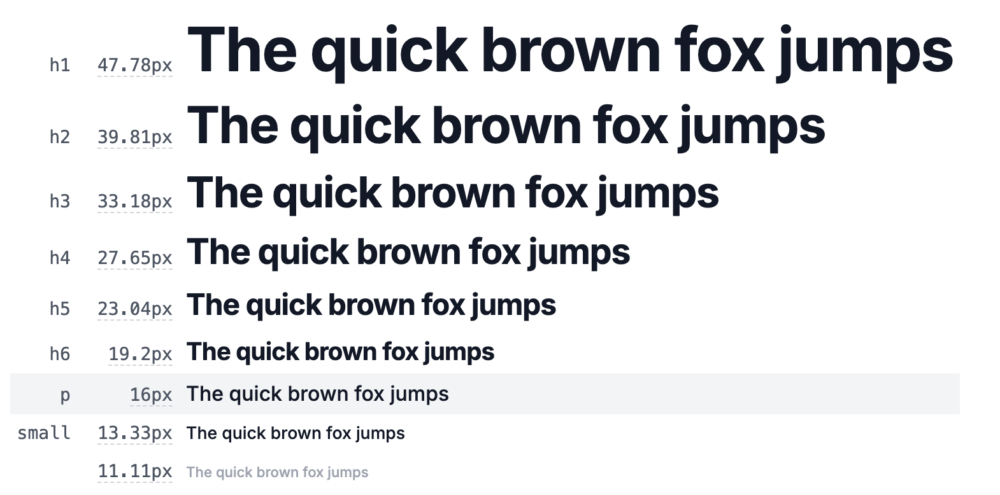  

**Color** schemes should align with **brand identity** or project goals. Dark mode? Minimalist? Vibrant? Use **contrast and accessibility checks** to make sure users can read text clearly. Use tools like [**colorhunt**](https://colorhunt.co/) to find cool color palletes!

### **Primary, Secondary & Accent Colors**  
- **Primary Color** –> The **main color** of the design, often used for branding, key UI elements, and major CTAs (Call-To-Action buttons).  
- **Secondary Color** –> A supporting color used for **contrast or differentiation**, such as secondary buttons or highlights.  
- **Accent Color** –> Used sparingly for emphasis, alerts, or **attention-grabbing elements**.  

### **Contrast & Typography**  
Contrast plays a critical role in **readability** and **accessibility**.  
- **High contrast** (e.g., dark text on a light background) improves readability and accessibility.  
- **Low contrast** can be used for subtle UI elements but should **never compromise legibility**.  

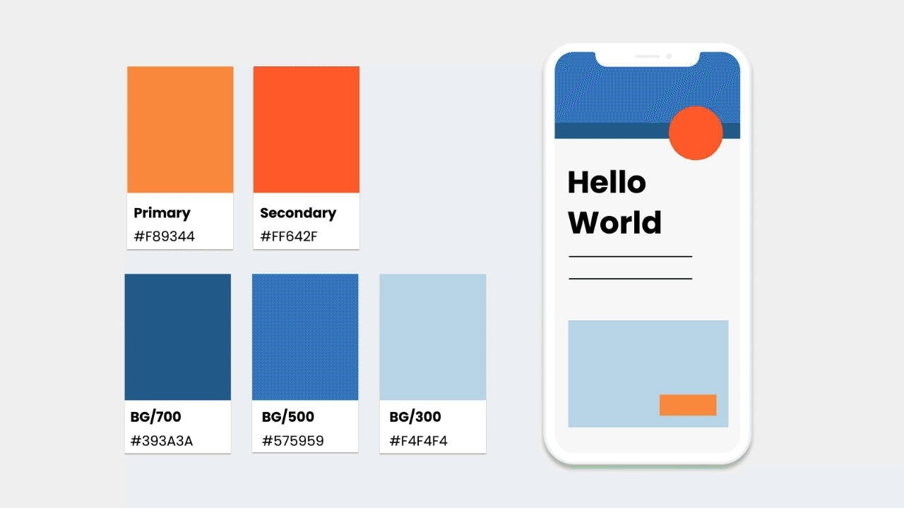

### **Applying Color in UI**  
✅ **60-30-10 Rule**:  

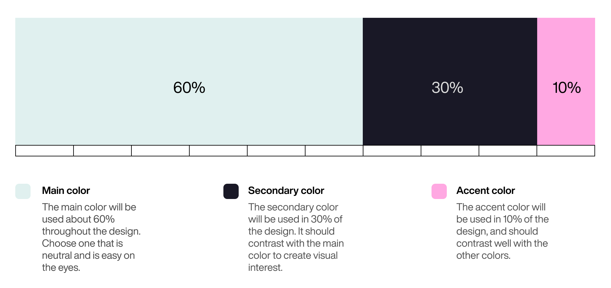

### **Activity: Realtime Colors 🖌️**  

Now that you understand **user flow, wireframing and design systems**, it's time to **put it all into practice**!  

A great tool to experiment with **color palettes, contrast, and real-time UI updates** is **[Realtime Colors](https://www.realtimecolors.com/)**.  

☐ **Test different primary, secondary, and accent colors** in a live UI.  
☐ **Check contrast & readability** to ensure accessibility.  
☐ **See instant previews** of how your colors affect the overall design.

## **Step 4: The Actual UI Design 🎨🔥**  

Now that you have your **building blocks**, it's time to design! Keep these **six key UI/UX principles** in mind:  

1️⃣ **Visual Hierarchy** –> Prioritize important elements.  
2️⃣ **Contrast** –> Make text readable.  
3️⃣ **Balance** –> Space elements evenly.  
4️⃣ **Consistency** –> Keep styles uniform.  
5️⃣ **Simplicity** –> Avoid unnecessary clutter.  
6️⃣ **Interaction Feedback** – Show responses to user actions.  

### **Prototyping & Testing**  
UI design isn’t just assembling elements—it’s about **testing, iterating, and refining** the design. Prototyping in **Figma or Adobe XD** helps visualize user interactions before development.  

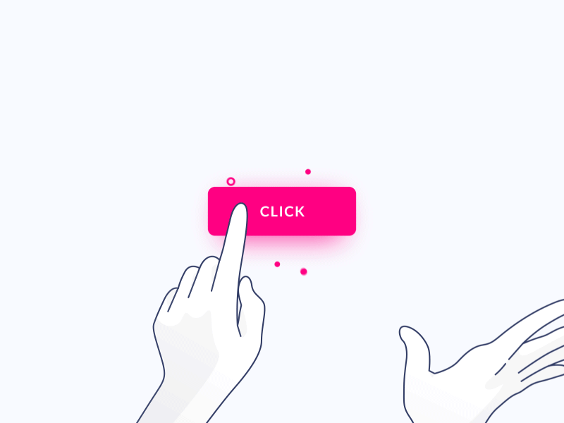

### **Activity: Create a Homepage! 🎨**

:::important
Now that you have experimented at previous **Realtime Colors** activity, it’s time for a hands-on challenge: **design a UI homepage** for a website! This activity will help you apply everything you’ve learned about **User Flow, Wireframing, Colors, and UI**.  
:::

#### **📌 Activity Instructions:**  
1️⃣ **Use Google Slides** to design a homepage layout.  
2️⃣ Apply the **color palette** you created in [Realtime Colors](https://www.realtimecolors.com/).  
3️⃣ Incorporate UI/UX principles like **visual hierarchy, contrast, and consistency**.  
4️⃣ Use **Google Slides default fonts** to keep it simple and accessible.  
5️⃣ Keep in mind **user experience**—the layout should be intuitive and visually appealing.  

Your homepage could be for:  
**A portfolio website** (showcasing design work).  
**An e-commerce site** (featuring a product or brand).  
**A tech startup** (introducing a product or service).  
**A blog or news site** (highlighting content).  
**A landing page for an event** (conference, workshop, or course).  

#### **🔍 Finding Inspiration**  
Not sure where to start? Look for **real-world examples** and **designs** at:  
👉 [Dribbble](https://dribbble.com/)  
👉 [Pinterest](https://www.pinterest.com/)  

💡 **Use keywords like:**  
🔹 **UI/UX**  
🔹 **Website design**  
🔹 **Website color palette**  

---

## **Final Thoughts**  

Great UI/UX design isn’t about making things look pretty—it’s about **guiding users effortlessly** through an experience. From mapping out user journeys to fine-tuning colors and typography, the key is **designing with purpose**.  

🎨 **Next Steps?** 
Start experimenting! Try designing your first UI prototype in **Figma**, apply these principles, and refine your skills.  

:::important
Stay tuned for upcoming posts! 
:::

Post by: Artecs 2025 Team
